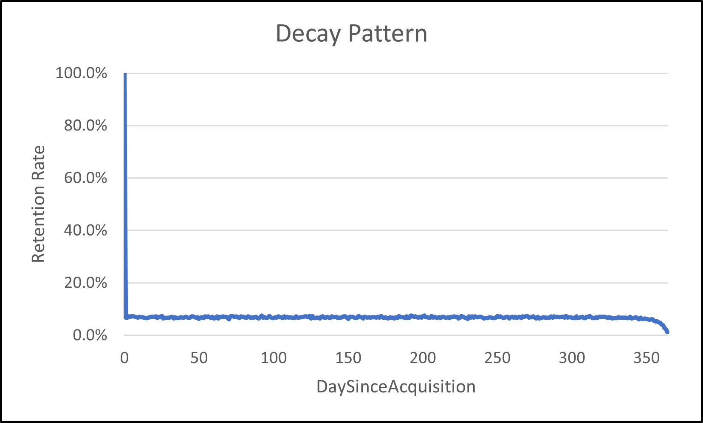

# gamelofts_demo
a demo for a job I am applying at gamelofts

# 5 Areas of Interest
Borrowing from the concepts of e-commerce, I assume these five areas would be most important as the outcome of analysis.
* GROWTH
* RETENTION
* STOCK MANAGEMENT
* ENGAGEMENT
* PRICING

## Data Generation

For the purpose of demo-ing the SQL codes I will be generating fake e-commerce data using Python.

A separate set of data will be generated for each task. (meaning independence)

table | description
--- | ---
daily_activity | table containing user activities such as 'sign-up', 'sign-in', 'purchase'
dim_customer | a cohort table to be computed with SQL

see the detailed python code [here](generation.ipynb).

## Encoding

Code | Activity
--- | ---
0 | sign-up
1 | sign-in
2 | purchase

## Loading Data Into MySQL

```sql
CREATE TABLE daily_activity (
	`index` INT,
	`CustomerId` INT,
	`ActivityDate` DATE,
	`ActivityType` INT
)
```

```sql
LOAD DATA INFILE "C:/ProgramData/MySQL/MySQL Server 8.0/Uploads/data.csv" INTO TABLE daily_activity
	FIELDS TERMINATED BY ','
	IGNORE 1 LINES;
```
For some reason there are a few missing CustomerID, but we will let that go for the sake of time.
```sql
>> SELECT count(distinct CustomerID) FROM daily_activity
9889
```

## Retention Studies

suppose we are continuously upsert-ing into dim_customer (which contains the AcquisitionDate),
from the daily_activity table\
we could use the following code:

```sql
CREATE TABLE dim_customer (
	`CustomerId` INT KEY,
	`AcquisitionDate` DATE
)
```
```sql
delimiter //

CREATE DEFINER=`root`@`%` PROCEDURE `update_dim_customer`(`date` DATE)
BEGIN
	INSERT IGNORE INTO dim_customer
	SELECT
	 COALESCE(dc.CustomerId, ac.CustomerId) AS CustomerId, 
	 ac.ActivityDate AS AcquisitionDate
	FROM dim_customer dc
	RIGHT JOIN (
	 SELECT 
	  CustomerId,
	  ActivityDate
	 FROM daily_activity 
	 WHERE 
	  ActivityType = 0
	  AND ActivityDate = `date`
	 GROUP BY 1, 2
	) ac 
	 ON dc.CustomerId = ac.CustomerId
	GROUP BY 1, 2;
END
```
```sql
delimiter //

CREATE PROCEDURE doiterate()
BEGIN
  SET @running_date = '2017-01-01';
  SET @num = 0;
  label1: LOOP
    SET @num = @num + 1;
	SET @running_date = DATE_ADD(@running_date, INTERVAL 1 DAY);
	CALL update_dim_customer(@running_date);
    IF @num < 365 THEN
      ITERATE label1;
    END IF;
    LEAVE label1;
  END LOOP label1;
END;
```
Finally, calling the doiterate function
```sql
CALL doiterate()
```
```sql
SELECT * FROM demo.dim_customer ORDER BY AcquisitionDate;
```
CustomerId | AcquisitionDate
--- | ---
3418 | 2017-01-01
1641 | 2017-01-01
5642 | 2017-01-01
4307 | 2017-01-01
7302 | 2017-01-01
... | ...

We have exactly one entry for each distinct CustomerID in daily_activity
```sql
>> SELECT COUNT(*) FROM demo.dim_customer;
9889
```
Let's run the below code for deducing the customer activity level since sign-up\
by replacing <MIN_DATE> with '2017-01-01'
```sql
SELECT
	DATEDIFF(ac.ActivityDate, dc.AcquisitionDate) AS DaySinceAcquisition,
	COUNT(DISTINCT ac.CustomerId) AS D1ActiveCustomers
FROM dim_customer dc
LEFT OUTER JOIN (
	SELECT
		CustomerId, 
		ActivityDate
	FROM daily_activity
	WHERE 
		ActivityType IN (0, 1)
		AND ActivityDate >= '<MIN_DATE>'
	GROUP BY 1,2
) ac 
	ON dc.CustomerId = ac.CustomerId 
	AND dc.AcquisitionDate <= ac.ActivityDate
WHERE 
	dc.AcquisitionDate >= '<MIN_DATE>'
GROUP BY 1
```
DaySinceAcquisition | D1ActiveCustomers
--- | ---
0 | 9889
1 | 665
2 | 673
3 | 708
4 | 700
5 | 739

Now let's see the decay pattern, which we expect to be constant (uniformly distributed and not decaying)



# footnotes

word | meaning
--- | ---
COALESCE | to come together to form one larger group, substance, etc
SKU | Stock Keeping Unit
